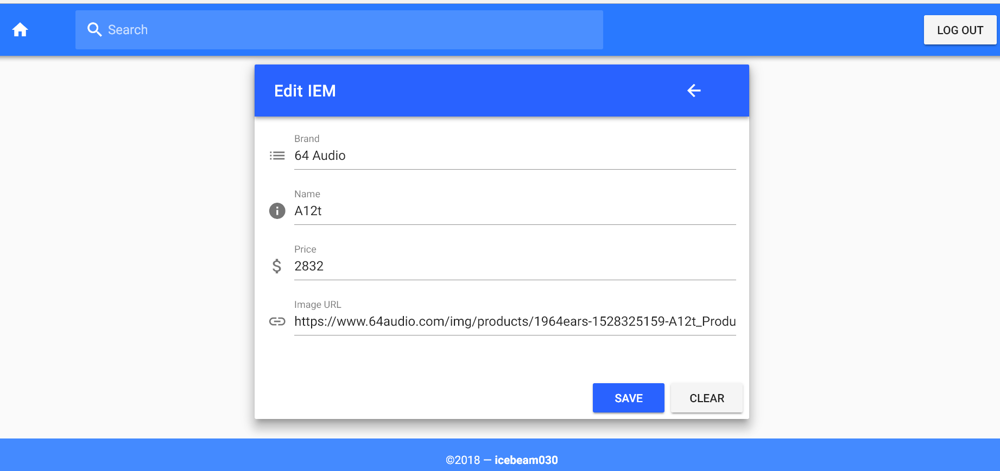

# iem-hub
A [Vue.js](https://vuejs.org/v2/guide/index.html) / [Express.js](https://expressjs.com/) full-stack web app for managing your favourite IEMs (In Ear Monitor)

### See the technical documentations
[Client](./client/README.md)

[Server](./server/README.md)

### Screenshots
Login

Main view

Edit IEM

