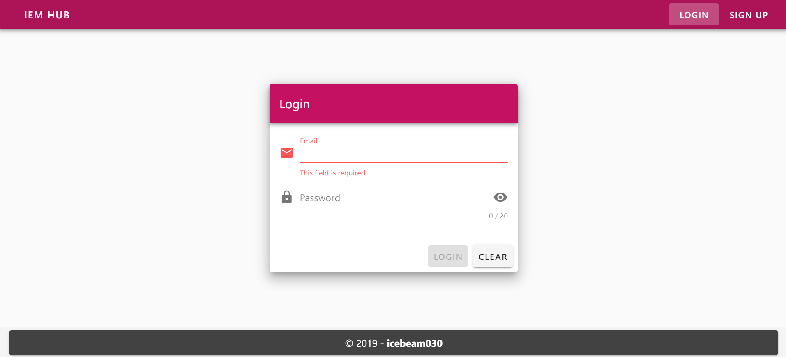
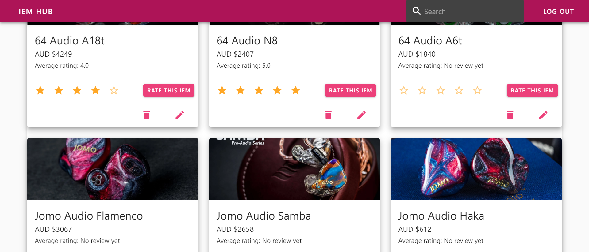
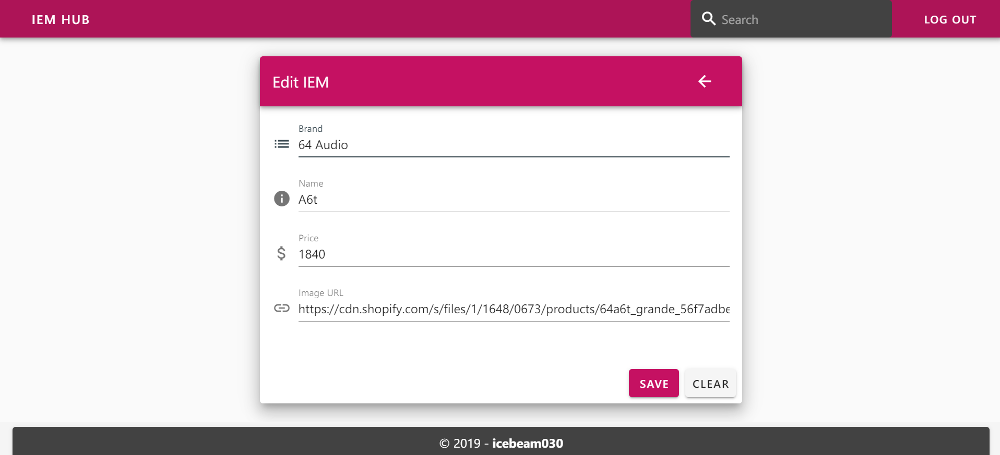

# iem-hub
A [Vue.JS](https://vuejs.org/v2/guide/index.html) / [Express.JS](https://expressjs.com/) full-stack web app for managing your favourite IEMs (In Ear Monitor)

## See the technical documentations
- [Client](./client/README.md)

- [Server](./server/README.md)

## Future plan and development guide
- Add settings so that colour themes can be changed etc.
- User can search by price, brand, etc.
- User can view their favourites, set avatar, etc.

## Screenshots
#### - Login

#### - Main view

#### - Edit IEM

